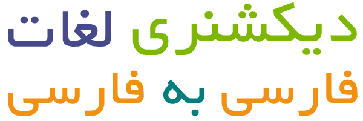

  <!--<h1>Persian to Persian Dictionary</h1>-->
  
دیکشنری و لغات فارسی به فارسی

 

<!-- About the Project -->

## :star2: About the Project

فرهنگ لغات فارسی به همراه لیست کلمات شامل بیش از بیست هزار کلمه.

<!-- Roadmap -->

## :compass: TODO

* [x] اضافه کردن لیست کلمات
* [ ] اضافه کردن فرهنگ لغات دیگر با تعداد کلمات بیشتر
* [ ] فرهنگ موضوعی؟ مثلا لغات فقط مربوط به مکان ها و ...

<!-- Known Issues -->

<!--## :warning: Known Issues

* issue 1
-->
<!-- Contributing -->

## :wave: Contributing

Contributions are always welcome!

<!-- License -->

## :warning: License

توزیع شده در بستر لایسنس GNU GPL V2.

<!-- Contact -->

## :handshake: Contact

سیدمنصور میربهبهانی - sm.mirbehbahani@gmail.com

<!-- Acknowledgments -->

## :gem: Acknowledgements
- [Awesome Readme Template](https://github.com/Louis3797/awesome-readme-template)